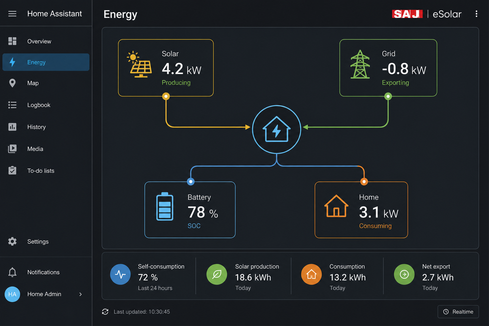

# Home Assistant SAJ eSolar _Elekeeper_ Custom Integration


This integration connects SAJ/Elekeeper cloud systems to Home Assistant. It supports **on-grid (R5)**, **storage (H1/H2)**, **AC coupling**, **parallel plants**, **SEC meters**, and **external battery packs** — with a device hierarchy designed for both simple and complex installations.

## Why this integration?

- **Multi-system support** — R5, H1, H2, meters, EMS, and multi-battery setups in one integration
- **Energy Dashboard ready** — dedicated plant sensors with correct `device_class` / `state_class` for solar, grid, load, and battery energy
- **Clear device tree** — plant → inverter / meter / battery devices with `via_device` linking
- **Rich detail when needed** — optional inverter sensors and PV/grid attributes without flooding every setup
- **Robust cloud auth** — token cache, automatic re-login, captcha guidance, diagnostics export
- **33 languages** — full UI, config flow, and Energy Dashboard sensor translations for Europe (plus Chinese for the CN node)

This version uses the Elekeeper portal API (password encryption and request signing). Keys are extracted from the portal; if SAJ changes them, an update may be required.

## Languages

Home Assistant picks the matching locale automatically from your profile language.

| Region | Locales |
|--------|---------|
| **Western & Central Europe** | English (`en`), German (`de`), French (`fr`), Dutch (`nl`) |
| **Iberia** | Spanish (`es`), Portuguese (`pt`), Catalan (`ca`), Basque (`eu`), Galician (`gl`) |
| **Nordic & Baltic** | Danish (`da`), Norwegian Bokmål (`nb`), Swedish (`sv`), Finnish (`fi`), Icelandic (`is`), Estonian (`et`), Latvian (`lv`), Lithuanian (`lt`) |
| **Central & Eastern Europe** | Polish (`pl`), Czech (`cz`), Slovak (`sk`), Hungarian (`hu`), Romanian (`ro`), Bulgarian (`bg`), Ukrainian (`ua`), Serbian (`sr`), Croatian (`hr`), Slovenian (`sl`) |
| **Southern Europe** | Italian (`it`), Greek (`el`), Maltese (`mt`) |
| **Celtic** | Irish (`ga`), Welsh (`cy`) |
| **Asia (CN node)** | Chinese (`cn`) |

All listed locales include config flow, options, repair issues, region selector, and dashboard entity names/states.

[](https://my.home-assistant.io/redirect/hacs_repository/?owner=erelke&repository=ha-esolar&category=integration)

[](https://www.buymeacoffee.com/erelke)

## Device hierarchy

| Device | Example | Notes |
|--------|---------|-------|
| **Plant** | `Home Solar` | System overview, energy totals, dashboard power sensors |
| **Inverter** | `Inverter M5370G…` | Per-inverter detail (optional, configurable) |
| **Battery** | `Home Solar Battery 1` | External or builtin packs when reported by the API |
| **Meter** | `Meter …` | SEC/module meters when installed |

On **R5 on-grid** plants fewer battery and SEC entities appear — the integration only creates sensors when the API provides data.

## Energy Dashboard

Dedicated plant sensors (translated, per plant):

| Sensor | Unit | Energy Dashboard use |
|--------|------|----------------------|
| Grid power | W | Live monitoring (signed: import + / export −) |
| PV power | W | Solar flow |
| Load power | W | Consumption |
| Plant energy today / buy / sell / load | kWh | Production, grid, home |
| Battery SOC / charge / discharge | % / kWh | Storage (H1/H2 only) |
| Self-use rate | % | Autoconsumption |
| Device online / Inverter status | — | Health |

Example configuration: [`docs/energy_dashboard.yaml`](docs/energy_dashboard.yaml)



```yaml
energy:
  solar_production:
    - entity: sensor.home_solar_plant_energy_today
  grid_consumption:
    - entity: sensor.home_solar_today_buy_energy
  grid_export:
    - entity: sensor.home_solar_today_sell_energy
  home_consumption:
    - entity: sensor.home_solar_today_load_energy
  battery:
    - entity: sensor.home_solar_battery_state_of_charge
  battery_consumption:
    - entity: sensor.home_solar_today_discharge_energy
  battery_production:
    - entity: sensor.home_solar_today_charge_energy
```

Replace entity IDs with your plant slug from **Settings → Devices & services → Entities**.

Integration:


Config options:


Sensors:


Diagnostics:


## Bug report & Development requests & diagnostics data

In case of an error or improvement request, please send the diagnostic data as well. See the image:


---

# Home Assistant SAJ eSolar Custom Integration
This integration uses cloud polling from the SAJ eSolar portal using a reverse engineered private API. 
Thanks to [SAJ eSolar](https://github.com/djansen1987/SAJeSolar) for inspiration.

This integration is based on [faanskit/ha-esolar](https://github.com/faanskit/ha-esolar) and inspired by [SAJeSolar](https://github.com/djansen1987/SAJeSolar).

The focus remains to avoid hundreds of entities on large systems: core metrics are **dedicated sensors** (Energy Dashboard, automations), while deep inverter/PV/grid detail stays in **attributes** when enabled in options. 

As an example, the H1 Inverter Power sensor has 50 information elements (15 x 3 + 5) published as attributes. This is a bit against the nature of Home Assistant development, but given a system comprising two plants, one R5 and two H1 - the amount of sensors would easly be in the hundreds. Therefore, this integration aims to publish only what is relevant as sensors.


These attributes can be fetched by implementing a template sensor using jinja2. An example of that can be found in the advanced section below.

# Installation
### HACS
[](https://my.home-assistant.io/redirect/hacs_repository/?owner=erelke&repository=ha-esolar&category=integration)

### Manual
- Copy directory `custom_components/saj_esolar_air` to your `<config dir>/custom_components` directory.
- Restart Home-Assistant.

## Enable the integration
Go to Settings / Devices & Services / Integrations. Click **+ ADD INTERATION**


Search for eSolar and click on it


Enter your SAJ eSolar username and password


If you have more than one site, select which of the sites that shall be installed


Following a succesful installation, a device per plant will be created


You can see that a number of devices and entites has been created at the SAJ eSolar integration


If you click on the devices, you can see this also in the Devices section


Your home screen will now have a number of new entities depending on your system. A R5 system will have two sensors (Status and Energy) and a H1 System will have five sensors (Status, Sell Energy, Buy, Energy, Charge Energy, Discharge Energy)


## Configuration
If you need more sensor and more detailed attributes in the sensors, you can configure the integration as follows

Go to Settings / Devices & Services / SAL eSolar. Click **CONFIGURE**.

Select if you want additional inverter sensors and if you want Photovoltaics and Grid attributes.
Take note that the Photovoltaics and Grid attributes will pull additional data from the SAJ servers.


After the configuration is done you need to restart the integration. Click **...** and select **Reload**


The system will now reload and add two-tre new sensors per inverter (Energy Total, Power and for H1 system Battery SoC)


## Final result
When the system is fully set up it can look something like this


# Advanced
### Creating a template sensor based on sensor attributes.
The below example will fetch the battery direction from the inverter energy total sensor and publish that as a new sensor
```
template:
  - sensor:
      - name: "Battery Direction"
        unique_id: inverter_ass111111111111111_energy_total_battery_direction
        state: >
          {{state_attr('sensor.inverter_ass111111111111111_energy_total', 'Battery Direction')}}
```
# Donations
I mainly did this project as a learning experience for myself and have no expectations from anyone.

If you like what have been done here and want to help I would recommend that you firstly look into supporting Home
Assistant. 

You can do this by purchasing some swag from their [store](https://teespring.com/stores/home-assistant-store)
or paying for a Nabu Casa subscription. None of this could happen without them.

After you have done that if you still feel this work has been valuable to you I welcome your support through BuyMeACoffee.

<a href="https://www.buymeacoffee.com/erelke"></a>